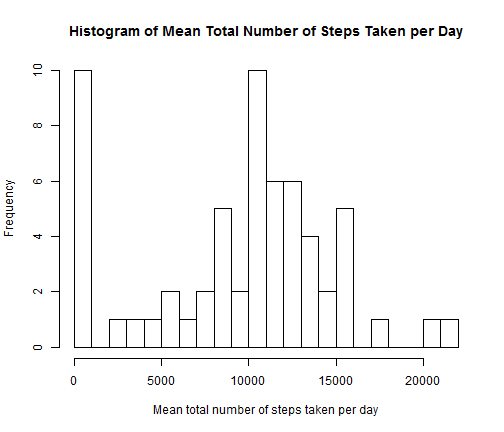
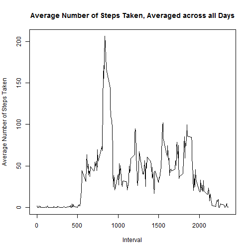
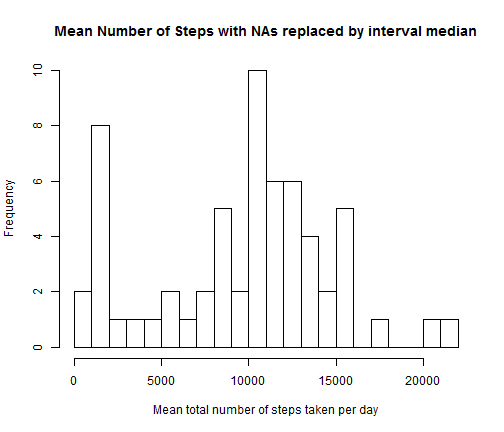
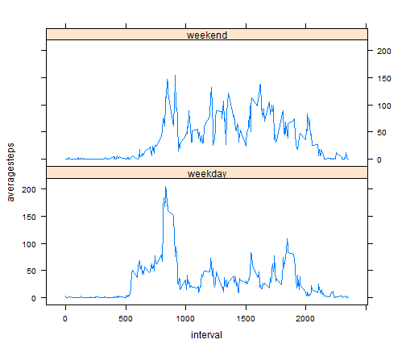

# Reproducible Research Peer Assessment 1

```r
options(digits = 2)
opts_chunk$set(echo = TRUE)
```


## Loading and preprocessing the data

### 1. Load the data


```r

activityData <- read.csv("activity.csv", header = TRUE)
```


### 2. Process the data


```r

require(plyr)
```

```
## Loading required package: plyr
```

```r
activitySummary <- ddply(activityData, .(date), summarize, totalsteps = sum(steps, 
    na.rm = TRUE))
```


## What is mean total number of steps taken per day?

### 1. Make a histogram of the total number of steps taken each day


```r

hist(activitySummary$totalsteps, breaks = 25, xlab = "Mean total number of steps taken per day", 
    main = "Histogram of Mean Total Number of Steps Taken per Day")
```

 


### 2. Calculate and report the mean and median total number of steps taken per day


```r

meansteps <- mean(activitySummary$totalsteps, na.rm = TRUE)
mediansteps <- median(activitySummary$totalsteps, na.rm = TRUE)
```


The mean number of steps taken each day is 9354.23. The median number of steps taken each day is 10395.

## What is the average daily activity pattern?

### 1. Make a time series plot


```r

IntervalSummary <- ddply(activityData, .(interval), summarize, averagesteps = mean(steps, 
    na.rm = TRUE))
plot(IntervalSummary$interval, IntervalSummary$averagesteps, type = "l", xlab = "Interval", 
    ylab = "Average Number of Steps Taken", main = "Average Number of Steps Taken, Averaged across all Days")
```

 


### 2. Which 5-minute interval, on average across all the days in the dataset, contains the maximum number of steps?


```r

maxsteps <- max(IntervalSummary$averagesteps)
maxinterval <- IntervalSummary$interval[IntervalSummary$averagesteps == maxsteps]
```


The 5 minute interval, averaged across all days, with the maximum number of steps is 835-840 with 206.17 steps.

## Imputing missing values

### 1. Calculate and report the total number of missing values in the dataset


```r
intervalNA <- sum(is.na(activityData$steps))
```


The total number of intervals with missing step values is 2304.

### 2. Devise a strategy for filling in all of the missing values in the dataset.

The missing values will be filled in using the median value for the 5 minute interval.

### 3. Create a new dataset that is equal to the original dataset but with the missing data filled in.


```r

intervalmedians <- ddply(activityData, .(interval), summarize, mediansteps = median(steps, 
    na.rm = TRUE))
replaceData <- activityData
for (i in 1:nrow(replaceData)) {
    if (is.na(replaceData$steps[i])) {
        replaceData$steps[i] <- intervalmedians$mediansteps[intervalmedians$interval == 
            replaceData$interval[i]]
    }
}
```


### 4. Make a histogram of the total number of steps taken each day and Calculate and report the mean and median total number of steps taken per day. 


```r

replaceSummary <- ddply(replaceData, .(date), summarize, totalsteps = sum(steps))
hist(replaceSummary$totalsteps, breaks = 25, xlab = "Mean total number of steps taken per day", 
    main = "Mean Number of Steps with NAs replaced by interval median")
```

 

```r

meanrepsteps <- mean(replaceSummary$totalsteps)
medianrepsteps <- median(replaceSummary$totalsteps)
```


The mean number of steps taken each day is 9503.87. The median number of steps taken each day is 10395. The mean has increased by 149.64, while the median remains unchanged. Replacing the missing values with the interval median has reduced the number of days with 0 steps, slightly increasing the mean total number of steps taken per day.

## Are there differences in activity patterns between weekdays and weekends?

### 1. Create a new factor variable in the dataset with two levels – “weekday” and “weekend” indicating whether a given date is a weekday or weekend day.


```r

replaceData$date <- as.Date(replaceData$date)
replaceData <- cbind(replaceData, weekdays(replaceData$date), rep(NA))
colnames(replaceData)[4:5] <- c("day", "weekday")
for (i in 1:nrow(replaceData)) {
    if (replaceData$day[i] %in% c("Montag", "Dienstag", "Mittwoch", "Donnerstag", 
        "Freitag")) {
        replaceData$weekday[i] <- "weekday"
    } else replaceData$weekday[i] <- "weekend"
}
```


### 2. Make a panel plot containing a time series plot


```r

require(lattice)
```

```
## Loading required package: lattice
```

```r
par(mfrow = c(1, 2))
xyplot(steps ~ interval | weekday, data = replaceData, type = "l", layout = c(1, 
    2))
```

 
